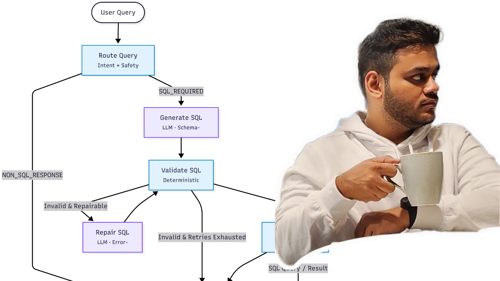

# Text-to-SQL Agent — Deterministic Core with Tool-Based Reasoning

## Overview

This repository implements a **production-grade Text-to-SQL system** designed around a simple principle:

> "**Deterministic systems execute. LLMs reason.**"

The system guarantees:
- No unvalidated SQL execution
- Bounded retries
- Explicit failure modes
- Full observability of every decision

LLMs are invoked for:
- SQL repair after validation failure
- Human-in-the-loop clarification for ambiguous queries
- Post-execution result summarization

All other execution paths remain deterministic.

## Architecture

The system is built as a **stateful execution graph** with explicit routing and bounded transitions.


### Key Properties

- **Deterministic execution**: SQL is generated, validated, and executed under strict rules.
- **Tool-based reasoning**: LLMs are invoked through explicit tools with scoped inputs/outputs.
- **Bounded retries**: Infinite loops are structurally impossible.
- **Human-in-the-loop (HITL)**: Ambiguous or unsafe queries trigger clarification instead of guessing.
- **Full observability**: Every tool invocation is surfaced in the response.

## Quick Start

### 1. Clone the Repository

```
git clone https://github.com/ZubinMehta27/text-to-sql.git
cd text-to-sql
```

### 2. Create a Virtual Environment

```
python -m venv .venv
source .venv/bin/activate   # macOS / Linux
# .venv\Scripts\activate    # Windows
```

### 3. Install Dependancies

```
pip install -r requirements.txt
```

### 4. Set Environment Variables
```
OPENAI_API_KEY=your_api_key_here

**Note:**
Each user must provide their own OpenAI API key.
The key is used only for LLM reasoning tools, never for direct SQL execution.
```

### 5. Start the API Server
```
uvicorn main:app --reload
```
The server will be available at:
```
http://localhost:8000
```

### 6. Send a Query
```
curl -X POST http://localhost:8000/chat \
  -H "Content-Type: application/json" \
  -d '{
    "query": "Who has the highest total invoice amount?"
  }'
```

### 7. Example Response

```
{
  "answer": {
    "type": "table",
    "data": [...],
    "summary": "Helena Holý has the highest total invoice amount."
  },
  "metadata": {
    "execution_mode": "SQL_REQUIRED",
    "retry_count": 1
  },
  "invoked_tools": [
    {
      "tool": "repair_sql_query",
      "success": true,
      "reason": "query_repair"
    }
  ]
}
```

## Working Demo

This short demo shows the system running end-to-end:
- Local setup
- API startup
- Real query execution
- Deterministic + tool-based behavior in action

▶️ **Watch the demo:**
[](https://youtu.be/ymLCIWW8b-o) 
